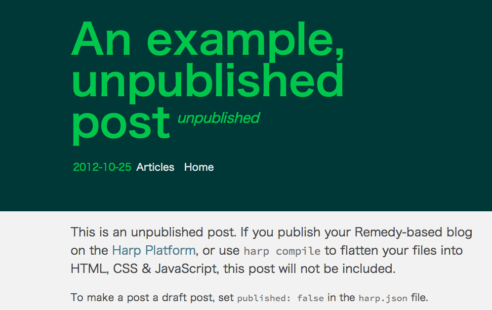

# Remedy-enhanced

An enhanced version of [remedy](https://github.com/kennethormandy/hb-remedy) Harp boilerplate. [demo](http://blog.eisneim.com/)

##install
please see [remedy](https://github.com/kennethormandy/hb-remedy).

###added feature:
 - Code hightlight with Prism.js, this is the main reason I changed this boilerplate.
 - change opening header's background color in _data.json use syntax:`"headerbg":"bg"` 
 - set custom header image use syntax:`"cover":"developer.png"`
 - you can still set header image by setting the name of that image to article's file name without set `cover` inside _data.json.

### availiable header color:
you can add your own color in /_shared/footer.jade

```javascript
var bgcolors = {
	red:'#D84945',
	pale:'#d1d1d1',
	light_purple:'#CC99CD',
	purple:'#5C78C6',
	orange:'#FE6D44',
	coffee:'#AF7C49',
	blue:'#46788F',//316AAC
	cyan:'#8DC7F9',
	yellow:'#F4C800',
	green:'#00C74C',
	light_green:'#589A5F',
	lime:'#BAE256',
	dark:'#2D2D2D',
	bg2:'#3E4A55',
	bg:'#003837',
}
```